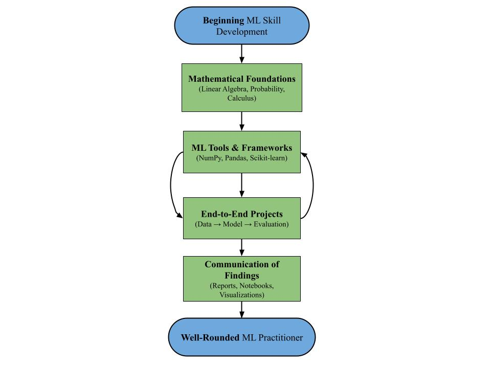

# Best Practices for Machine Learning Skill Development
Prepared for a Husky student pursuing a job as a Machine Learning Engineer  
Prepared by Erik Dhalla  
Date: January 26, 2026

## Table of Contents
[Purpose](#purpose)  
[Developing Mathematical Foundations](#developing-mathematical-foundations)  
[Learning ML Tools/Frameworks](#learning-ml-toolsframeworks)  
[Building ML Projects](#building-ml-projects)  
[Communicating ML Findings](#communicating-ml-findings)  
[References](#references)  

## Purpose
As you prepare to learn machine learning, developing both conceptual and applied competencies is essential. Coursework introduces the mathematical and computational ideas that underpin modern ML, but additional practices are needed to apply those ideas effectively. Building familiarity with common tools and frameworks allows students to experiment efficiently, while small, end-to-end projects synthesize theory into practical workflows. Communicating results and tradeoffs further reflects how ML is used in applied settings, where decisions depend on shared understanding rather than technical correctness alone. **Figure 1** provides an overview of how these practices reinforce one another, with the sections that follow offering more detailed guidance.  

**Figure 1.** Process flow illustrating ML Skill Development
  
*This flowchart condenses the incremental relationships between foundational skills, tools, projects, and communication, making it easier to see how these practices reinforce one another over time.*

## Developing Mathematical Foundations
Starting with a mathematical foundation reduces the likelihood that students will halt their project work to relearn fundamental concepts mid-way. These interruptions break momentum and make experimentation slower, as unfamiliar terms or operations become temporary bottlenecks. Establishing the foundation first keeps the workflow continuous and allows projects to focus on design decisions rather than retracing prerequisites.

Front-load foundational math through relevant coursework or structured self-study. For example, topics such as linear algebra, probability, and calculus form the basis of many ML workflows. The Machine Learning course at UW Seattle (CSE 446) lists matrix algebra and statistics as prerequisites, indicating that these areas are normally expected before engaging with applied ML work [^1]. Taking these courses earlier in the degree plan aligns with typical academic sequencing and prevents unnecessary relearning during project-driven experimentation.

## Learning ML Tools/Frameworks
Frameworks shorten the time between an idea and an experiment. Without them, students would reimplement standard components or rely on manual workarounds, which increases the time cost of exploration. In the same way that game engines prevent developers from rebuilding rendering or physics systems, ML frameworks abstract over tensor operations, model development, and evaluation utilities, providing ready-made tools and libraries for handling complex algorithms [^2]. Using these tools keeps the focus on experimentation and model behavior rather than reconstructing infrastructure under time constraints.

Practice using ML frameworks through structured experimentation. Tools such as NumPy and Pandas support data manipulation, while Scikit-learn and PyTorch provide abstractions for model training and evaluation [^2]. Environments such as Jupyter or Kaggle allow students to run small experiments without building infrastructure from scratch, keeping project work focused on model behavior and design decisions.

## Building ML Projects
Projects expose students to the end-to-end workflow of machine learning, where the problem is not already defined and the data is not already prepared. They require identifying a question, working with real data, choosing models, evaluating results, and communicating findings. This synthesis connects coursework to applied practice and builds familiarity with how ML operates under uncertainty and iteration.

Build small, end-to-end ML projects. For example, beginner challenges such as the *Titanic* competition tasks learners to predict passenger survival, requiring data understanding, model choice, and evaluation [^3]. These projects treat machine learning as a full workflow rather than a single modeling exercise.

## Communicating ML findings
ML work produces results that require interpretation. Communicating model performance, tradeoffs, or data assumptions to non-specialists reflects how ML is used in applied environments, where decisions depend on shared understanding rather than technical correctness alone [^4].

Summarize and visualize ML findings for an audience. Use reports, notebooks, or presentations to explain model performance, data assumptions, and tradeoffs in a way that enables decision-making. Kaggle notebooks illustrate this format by combining code, commentary, and visualizations.

## References
[1] 	"CSE446: Machine Learning," Paul G. Allen School of Computer Science & Engineering, [Online]. Available: https://courses.cs.washington.edu/courses/cse446/. [Accessed Jan. 24 2026].  
[2] 	Coursera Staff, "What Are Machine Learning Frameworks?," Coursera, 23 January 2026. [Online]. Available: https://www.coursera.org/articles/machine-learning-frameworks. [Accessed Jan. 24 2026].  
[3] 	W. Cukierski, "Titanic - Machine Learning from Disaster," Kaggle, 2012. [Online]. Available: https://www.kaggle.com/c/titanic. [Accessed Jan. 25 2026].  
[4] 	TDS Editors, "The Key to Success in Industry? Learn to Communicate Results Effectively," Towards Data Science, 21 July 2021. [Online]. Available: https://towardsdatascience.com/the-key-to-success-in-industry-learn-to-communicate-results-effectively-2e68d83b2c74/. [Accessed Jan. 26 2026].